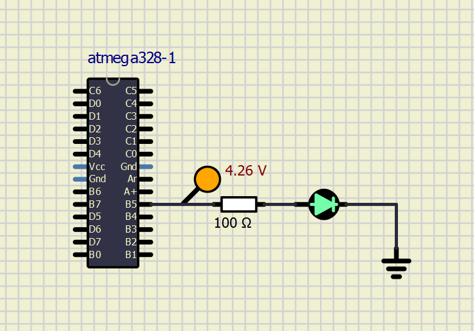

# Lab 1: Git version-control system, AVR tools
The purpose of this laboratory exercise is to learn how to use the git versioning system, write the markdown readme file, learn the basic structure of C code, and learn how to use development tools to program a microcontroller on the Arduino Uno board.

## Preparation tasks
I have downloaded all the necessary files and logged into my GitHub account.

## Lesson tasks
- [x] Read through one of the GitHub manuals attached to the task.
- [x] Synchronize my local PC repository with my Github Account.
- [x] Install and try out Atmel Studio 7 for Windows. Open LED example project. 
- [x] Install and open SimulIDE.
- [ ] Try out the Logic Analzyer device.
I believe that I will eventually get to try out the Logic Analzyer in the upcoming weeks.

## Individual tasks
- [x] Download AVR development tools on my PC.
- [x] Create an algorithm that repeatedly displays DE2 in Morse code using led on the UNO Board.
- [x] Simulate the UNO circuit in SimulIDE.

### AVR tools


### Copy of modifed `main.c` file
```C
#define LED_GREEN   PB5 // AVR pin where green LED is connected
#define RESET_DELAY	4000	// Delay in milliseconds
#define PAUSE_DELAY	1000 // Delay in milliseconds
#define SHORT_DELAY 200 // Delay in milliseconds
#define LONG_DELAY	600 // Delay in milliseconds
#ifndef F_CPU           // Preprocessor directive allows for conditional
                        // compilation. The #ifndef means "if not defined".
# define F_CPU 16000000 // CPU frequency in Hz required for delay
#endif                  // The #ifndef directive must be closed by #endif

/* Includes ----------------------------------------------------------*/
/* Include another C language file into the current file at the location
 * of the #include statement prior to compiling the source code.
 */
#include <util/delay.h> // Functions for busy-wait delay loops
#include <avr/io.h>     // AVR device-specific IO definitions

/* Function definitions ----------------------------------------------*/
/**********************************************************************
 * Function: Main function where the program execution begins
 * Purpose:  Toggle one LED and use delay library.
 * Returns:  none
 **********************************************************************/
int main(void)
{
    // Set pin as output in Data Direction Register
    // DDRB = DDRB or 0010 0000
    DDRB = DDRB | (1<<LED_GREEN);

    // Set pin LOW in Data Register (LED off)
    // PORTB = PORTB and 1101 1111
    PORTB = PORTB & ~(1<<LED_GREEN);

    // Infinite loop
    while (1)
    {
		// Message generation
        // Pause several milliseconds
        _delay_ms(RESET_DELAY);
		
		// Sending "D"
		PORTB = PORTB | (1<<LED_GREEN);
		_delay_ms(LONG_DELAY);
		PORTB = PORTB & ~(1<<LED_GREEN);
		_delay_ms(SHORT_DELAY);
		PORTB = PORTB | (1<<LED_GREEN);
		_delay_ms(SHORT_DELAY);
		PORTB = PORTB & ~(1<<LED_GREEN);
		_delay_ms(SHORT_DELAY);
		PORTB = PORTB | (1<<LED_GREEN);
		_delay_ms(SHORT_DELAY);
		PORTB = PORTB & ~(1<<LED_GREEN);
		
		// Pause several milliseconds
		_delay_ms(PAUSE_DELAY);
		
		// Sending "E"
		PORTB = PORTB | (1<<LED_GREEN);
		_delay_ms(SHORT_DELAY);
		PORTB = PORTB & ~(1<<LED_GREEN);
		
		// Pause several milliseconds
		_delay_ms(PAUSE_DELAY);
		
		// Sending "2"
		PORTB = PORTB | (1<<LED_GREEN);
		_delay_ms(SHORT_DELAY);
		PORTB = PORTB & ~(1<<LED_GREEN);
		_delay_ms(SHORT_DELAY);
		PORTB = PORTB | (1<<LED_GREEN);
		_delay_ms(SHORT_DELAY);
		PORTB = PORTB & ~(1<<LED_GREEN);
		_delay_ms(SHORT_DELAY);
		PORTB = PORTB | (1<<LED_GREEN);
		_delay_ms(LONG_DELAY);
		PORTB = PORTB & ~(1<<LED_GREEN);
		_delay_ms(SHORT_DELAY);
		PORTB = PORTB | (1<<LED_GREEN);
		_delay_ms(LONG_DELAY);
		PORTB = PORTB & ~(1<<LED_GREEN);
		_delay_ms(SHORT_DELAY);
		PORTB = PORTB | (1<<LED_GREEN);
		_delay_ms(LONG_DELAY);
		PORTB = PORTB & ~(1<<LED_GREEN);
    }

    // Will never reach this
    return 0;
}
```

### Circuit simulation

You can view the simulation by downloading the `SimulIDE_Circuit.simu` file from this directory. 
