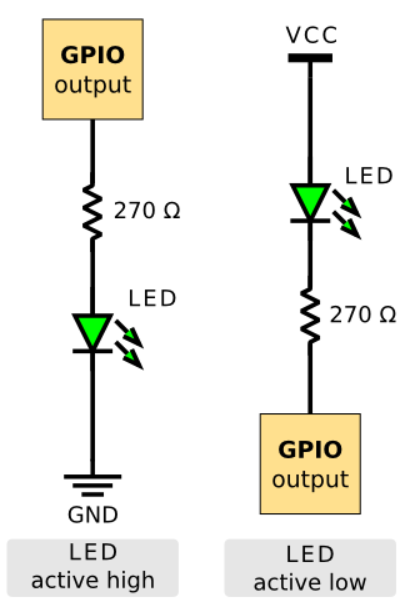
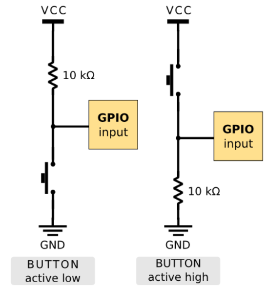

# Lab 2: Control of GPIO, LED, push button
The purpose of this laboratory exercise is to learn how to use basic input/output devices such as LEDs (Light Emitting Diodes) and push buttons, and how to control GPIO (General Purpose Input Output) pins with help of control registers.

## Preparation tasks

| **LED color** | **Supply voltage** | **LED current** | **LED voltage** | **Resistor value** |
| :-: | :-: | :-: | :-: | :-: |
| red | 5&nbsp;V | 20&nbsp;mA | 2V | 150 Ω |
| blue | 5&nbsp;V | 20&nbsp;mA | 4V | 50 Ω |

Images were taken from [openwrt.org documentation](https://openwrt.org/).

## Part 1: Active-low and active-high LEDs
| **DDRB** | **Description** |
| :-: | :-- |
| 0 | Input pin |
| 1 | Output pin |

| **PORTB** | **Description** |
| :-: | :-- |
| 0 | Output Low value |
| 1 | Output High value |

| **DDRB** | **PORTB** | **Direction** | **Internal pull-up resistor** | **Description** |
| :-: | :-: | :-: | :-: | :-- |
| 0 | 0 | input | no | Tri-state, high-impedance |
| 0 | 1 | input | yes | Port xn will source current if ext. pulled low |
| 1 | 0 | output | no | Output Low |
| 1 | 1 | output | no | Output High |

| **Port** | **Pin** | **Input/output usage?** |
| :-: | :-: | :-- |
| A | x | Microcontroller ATmega328P does not contain port A |
| B | 0 | Yes (Arduino pin 8) |
|   | 1 | Yes (Arduino pin 9) |
|   | 2 | Yes (Arduino pin 10) |
|   | 3 | Yes (Arduino pin 11) |
|   | 4 | Yes (Arduino pin 12) |
|   | 5 | Yes (Arduino pin 13) |
|   | 6 | Not assigned |
|   | 7 | Not assigned |
| C | 0 | Yes (Arduino pin A0) |
|   | 1 | Yes (Arduino pin A1) |
|   | 2 | Yes (Arduino pin A2) |
|   | 3 | Yes (Arduino pin A3) |
|   | 4 | Yes (Arduino pin A4) |
|   | 5 | Yes (Arduino pin A5) |
|   | 6 | Not assigned |
|   | 7 | Not assigned |
| D | 0 | Yes (Arduino pin RX<-0) |
|   | 1 | Yes (Arduino pin TX->1) |
|   | 2 | Yes (Arduino pin 2) |
|   | 3 | Yes (Arduino pin 3) |
|   | 4 | Yes (Arduino pin 4) |
|   | 5 | Yes (Arduino pin 5) |
|   | 6 | Yes (Arduino pin 6) |
|   | 7 | Yes (Arduino pin 7) |

