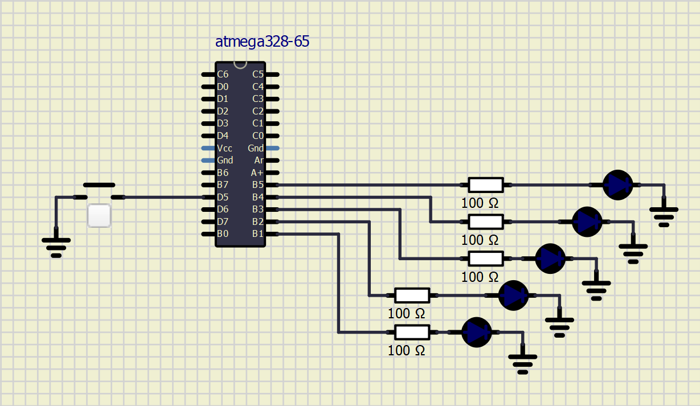

# Lab 2: David Sedláček

Link to my Github repository:
https://github.com/DavidSedlacekTN/Digital-electronics-2

## Preparation tasks


| **LED color** | **Supply voltage** | **LED current** | **LED voltage** | **Resistor value** |
| :-: | :-: | :-: | :-: | :-: |
| red | 5&nbsp;V | 20&nbsp;mA | 2V | 150 Ω |
| blue | 5&nbsp;V | 20&nbsp;mA | 4V | 50 Ω |


Images were taken from [openwrt.org documentation](https://openwrt.org/).

## Part 1: Active-low and active-high LEDs
| **DDRB** | **Description** |
| :-: | :-- |
| 0 | Input pin |
| 1 | Output pin |

| **PORTB** | **Description** |
| :-: | :-- |
| 0 | Output Low value(Sink) |
| 1 | Output High value(Source) |

| **DDRB** | **PORTB** | **Direction** | **Internal pull-up resistor** | **Description** |
| :-: | :-: | :-: | :-: | :-- |
| 0 | 0 | Input | No | Tri-state, high-impedance |
| 0 | 1 | Input | Yes | Port xn will source current if ext. pulled low |
| 1 | 0 | Output | No | Output Low |
| 1 | 1 | Output | No | Output High |

| **Port** | **Pin** | **Input/output usage?** |
| :-: | :-: | :-- |
| A | x | Microcontroller ATmega328P does not contain port A |
| B | 0 | Yes (Arduino pin 8) |
|   | 1 | Yes (Arduino pin 9) |
|   | 2 | Yes (Arduino pin 10) |
|   | 3 | Yes (Arduino pin 11) |
|   | 4 | Yes (Arduino pin 12) |
|   | 5 | Yes (Arduino pin 13) |
|   | 6 | Not assigned |
|   | 7 | Not assigned |
| C | 0 | Yes (Arduino pin A0) |
|   | 1 | Yes (Arduino pin A1) |
|   | 2 | Yes (Arduino pin A2) |
|   | 3 | Yes (Arduino pin A3) |
|   | 4 | Yes (Arduino pin A4) |
|   | 5 | Yes (Arduino pin A5) |
|   | 6 | Not assigned |
|   | 7 | Not assigned |
| D | 0 | Yes (Arduino pin RX<-0) |
|   | 1 | Yes (Arduino pin TX->1) |
|   | 2 | Yes (Arduino pin 2) |
|   | 3 | Yes (Arduino pin 3) |
|   | 4 | Yes (Arduino pin 4) |
|   | 5 | Yes (Arduino pin 5) |
|   | 6 | Yes (Arduino pin 6) |
|   | 7 | Yes (Arduino pin 7) |

## Part 2: Blinking LEDs
```C
int main(void)
{
	// Green LED at port B
	// Set pin as output in Data Direction Register...
	DDRB = DDRB | (1<<LED_GREEN_1);
	// ...and turn LED off in Data Register
	PORTB = PORTB & ~(1<<LED_GREEN_1);

	// Configure the second LED at port C
	// Set pin as output in Data Direction Register...
	DDRC = DDRC | (1<<LED_GREEN_2);
	// ...and turn LED off in Data Register
	PORTC = PORTC & ~(1<<LED_GREEN_2);

	// Infinite loop
	while (1)
	{
		// Pause several milliseconds
		_delay_ms(BLINK_DELAY);

		PORTB = PORTB ^ (1<<LED_GREEN_1);
		PORTC = PORTC ^ (1<<LED_GREEN_2);
	}

	// Will never reach this
	return 0;
}
```


## Part 3: Blinking LEDs with Button
```C
int main(void)
{
    // Green LED at port B
    // Set pin as output in Data Direction Register...
    DDRB = DDRB | (1<<LED_GREEN_1);
    // ...and turn LED off in Data Register
    PORTB = PORTB & ~(1<<LED_GREEN_1);

    // Configure the second LED at port C
	DDRC = DDRC | (1<<LED_GREEN_2);
	PORTC = PORTC & ~(1<<LED_GREEN_2);

    // Configure Push button at port D and enable internal pull-up resistor
	DDRD = DDRD & ~(1<<BUTTON);
	PORTD = PORTD | (1<<BUTTON);

    // Infinite loop
    while (1)
    {
        // Pause several milliseconds
        _delay_ms(BLINK_DELAY);

        // WRITE YOUR CODE HERE	
	if(bit_is_clear(PIND, BUTTON))
	{
		PORTB = PORTB ^ (1<<LED_GREEN_1);
		PORTC = PORTC ^ (1<<LED_GREEN_2);
		//loop_until_bit_is_set(PIND, BUTTON); // Only when I want to change LED values on button press
	}
		
    }

    // Will never reach this
    return 0;
}
```


## Part 4: Night Rider Schematic
