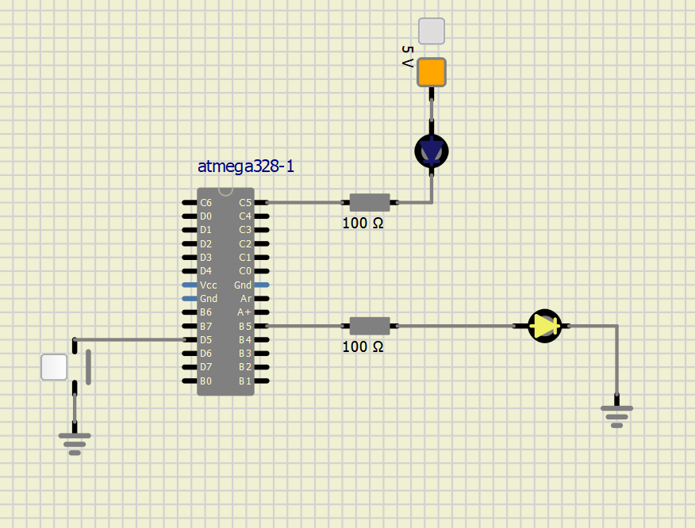
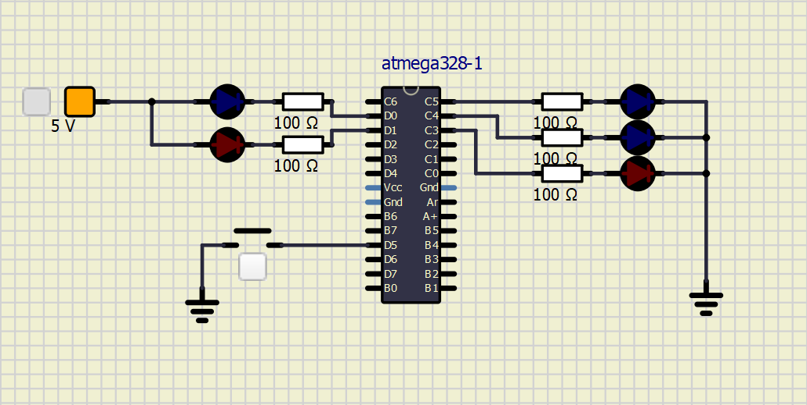

# Lab 3: David Sedláček

Link to my Github repository:
https://github.com/DavidSedlacekTN/Digital-electronics-2

## Preparation tasks
1. Fill in the following table and enter the number of bits and numeric range for the selected data types defined by C.

| **Data type** | **Number of bits** | **Range** | **Description** |
| :-: | :-: | :-: | :-- | 
| `uint8_t`  | 8 | 0, 1, ..., 255 | Unsigned 8-bit integer |
| `int8_t`   | 8 | -128, ..., 0, ..., 127 | 8-bit integer |
| `uint16_t` | 16 | 0 to 65,535 | Unsigned 16-bit integer |
| `int16_t`  | 16 | -32,768 to 32,767 | 16-bit integer |
| `float`    | 32 | -3.4e+38, ..., 3.4e+38 | Single-precision floating-point |
| `void`     | 0 | 0 | Empty value |

2. Functions

```C
#include <avr/io.h>

// Function declaration (prototype)
uint16_t calculate(uint8_t x, uint8_t y);

int main(void)
{
    uint8_t a = 156;
    uint8_t b = 14;
    uint16_t c;

    // Function call
    c = calculate(a, b);

    while (1)
    {
    }
    return 0;
}

// Function definition (body)
uint16_t calculate(uint8_t x, uint8_t y)
{
    uint16_t result;    // result = x^2 + 2xy + y^2

    result = x*x;
    result += 2*x*y;
    result += y*y;
    return result;
}
```

3. GPIO Library

Function declaration - Just specifies the name, parameters and return type of a function and does not have inners.
Function definition - It has its inners. It contains a block of code that is supposed to be executed after calling of the function.

```C
#define LED_GREEN_1   PB5
#define LED_GREEN_2   PC5
#define BUTTON_INPUT PD5
#include "gpio.h" 

int main(void)
{
    // Green LED at port B
    GPIO_config_output(&DDRB, LED_GREEN_1);
    GPIO_write_low(&PORTB, LED_GREEN_1);

    // Configure the second LED at port C
	GPIO_config_output(&DDRC, LED_GREEN_2);
	GPIO_write_low(&PORTC, LED_GREEN_2);

    // Configure Push button at port D and enable internal pull-up resistor
	GPIO_config_input_pullup(&DDRD, BUTTON_INPUT);

    // Infinite loop
    while (1)
    {
        // Pause several milliseconds
        _delay_ms(BLINK_DELAY);

		if (GPIO_read(&PIND, BUTTON_INPUT) == 0) {
			GPIO_toggle(&PORTB, LED_GREEN_1);
			GPIO_toggle(&PORTC, LED_GREEN_2);
		}
    }

    // Will never reach this
    return 0;
}
```


4. Traffic light

