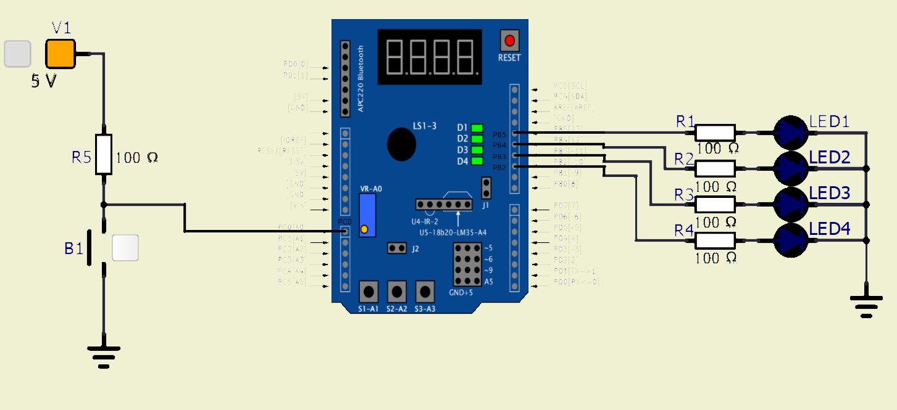

# Lab 4: Interrupts, timers

## 1. Overflow times for Timer/Counter modules that contain ATmega328P; CPU clock frequency is 16&nbsp;MHz.

| **Module** | **Number of bits** | **1** | **8** | **32** | **64** | **128** | **256** | **1024** |
| :-: | :-: | :-: | :-: | :-: | :-: | :-: | :-: | :-: |
| Timer/Counter0 | 8  | 16u | 128u | -- | 1.024m | -- | 4.096m | 16.384m |
| Timer/Counter1 | 16 | 4.096m | 32.768m | -- | 262.144m | -- | 1.048576 | 4.194304 |
| Timer/Counter2 | 8  | 16u | 128u | 512u | 1.024m | 2.048m | 4.096m | 16.384m |

## 2. Shield connections

| **LED** | **Connects to** | **Connects via** |
| :-: | :-: | :-: |
| D1 | PB5 | 1k Ohm resistor |
| D2 | PB4 | 1k Ohm resistor |
| D3 | PB3 | 1k Ohm resistor |
| D4 | PB2 | 1k Ohm resistor |

| **Button** | **Connects to** | **Pull-up resistor value** |
| :-: | :-: | :-: |
| S1-A1 | PC1 | 10k Ohm resistor |
| S1-A2 | PC2 | 10k Ohm resistor |
| S3-A3 | PC3 | 10k Ohm resistor |

## 3. Timers/Counters

| **Module** | **Operation** | **I/O register(s)** | **Bit(s)** |
| :-: | :-- | :-: | :-- |
| Timer/Counter0 | Prescaler<br><br>8-bit data value<br>Overflow interrupt enable | TCCR0B<br>TNCT0<br>TIMSK0 | CS02, CS01, CS00<br>(000: stopped, 001: 1, 010: 8, 011: 64, 100: 256, 101: 1024)<br>TCNT0[7:0]<br>TOIE0 (1: enable, 0: disable) |
| Timer/Counter1 | Prescaler<br><br>16-bit data value<br>Overflow interrupt enable | TCCR1B<br><br>TCNT1H, TCNT1L<br>TIMSK1 | CS12, CS11, CS10<br>(000: stopped, 001: 1, 010: 8, 011: 64, 100: 256, 101: 1024)<br>TCNT1[15:0]<br>TOIE1 (1: enable, 0: disable) |
| Timer/Counter2 | Prescaler<br><br>8-bit data value<br>Overflow interrupt enable | TCCR2B<br><br>TNCT2<br>TIMSK2 | CS22, CS21, CS20<br>(000: stopped, 001: 1, 010: 8, 011: 64)<br>TCNT2[7:0]<br>TOIE2 (1: enable, 0: disable) |

## 4. Interrupts

| **Program address** | **Source** | **Vector name** | **Description** |
| :-: | :-- | :-- | :-- |
| 0x0000 | RESET | -- | Reset of the system |
| 0x0002 | INT0  | `INT0_vect` | External Interrupt Request 0 |
| 0x0004 | INT1 | `INT1_vect` | External Interrupt Request 1 |
| 0x0006 | PCINT0 | `PCINT0_vect` | Pin Change Interrupt Request 0 |
| 0x0008 | PCINT1 | `PCINT1_vect` | Pin Change Interrupt Request 1 |
| 0x000A | PCINT2 | `PCINT2_vect` | Pin Change Interrupt Request 2 |
| 0x000C | WDT | `WDT_vect` | Watchdog Time-out Interrupt |
| 0x0012 | TIMER2_OVF | `TIMER2_OVF_vect` | Timer/Counter2 value Overflow |
| 0x0018 | TIMER1_COMPB | `TIMER1_COMPB_vect` | Compare match between Timer/Counter1 value and channel B compare value |
| 0x001A | TIMER1_OVF | `TIMER1_OVF_vect` | Timer/Counter1 value Overflow |
| 0x0020 | TIMER0_OVF | `TIMER0_OVF_vect` | Timer/Counter0 value Overflow |
| 0x0024 | USART_RX | `USART_RX_vect` | USART Rx Complete |
| 0x002A | ADC | `ADC_vect` | ADC Conversion Complete |
| 0x0030 | TWI | `TWI_vect` | 2-wire Serial Interface |

## 5. Timer Library

### 5.1 Header files listing, which defines settings for Timer/Counter0 & Timer/Counter2:
```c
/**
 * @name  Definitions for 8-bit Timer/Counter0
 * @note  t_OVF = 1/F_CPU * prescaler * 2^n where n = 8, F_CPU = 16 MHz
 */
#define TIM0_stop()           TCCR0B &= ~((1<<CS02) | (1<<CS01) | (1<<CS00));
/** @brief Set overflow 4ms, prescaler 001 --> 1 */
#define TIM0_overflow_4ms()   TCCR0B &= ~((1<<CS02) | (1<<CS01)); TCCR0B |= (1<<CS00);
/** @brief Set overflow 33ms, prescaler 010 --> 8 */
#define TIM0_overflow_33ms()  TCCR0B &= ~((1<<CS02) | (1<<CS00)); TCCR0B |= (1<<CS01);
/** @brief Set overflow 262ms, prescaler 011 --> 64 */
#define TIM0_overflow_262ms() TCCR0B &= ~(1<<CS02); TCCR0B |= (1<<CS01) | (1<<CS00);
/** @brief Set overflow 1s, prescaler 100 --> 256 */
#define TIM0_overflow_1s()    TCCR0B &= ~((1<<CS01) | (1<<CS00)); TCCR0B |= (1<<CS02);
/** @brief Set overflow 4s, prescaler // 101 --> 1024 */
#define TIM0_overflow_4s()    TCCR0B &= ~(1<<CS01); TCCR0B |= (1<<CS02) | (1<<CS00);
/** @brief Enable overflow interrupt, 1 --> enable */
#define TIM0_overflow_interrupt_enable()  TIMSK0 |= (1<<TOIE0);
/** @brief Disable overflow interrupt, 0 --> disable */
#define TIM0_overflow_interrupt_disable() TIMSK0 &= ~(1<<TOIE0);

/**
 * @name  Definitions for 8-bit Timer/Counter2
 * @note  t_OVF = 1/F_CPU * prescaler * 2^n where n = 8, F_CPU = 16 MHz
 */
#define TIM0_stop()           TCCR2B &= ~((1<<CS22) | (1<<CS21) | (1<<CS20));
/** @brief Set overflow 4ms, prescaler 001 --> 1 */
#define TIM0_overflow_4ms()   TCCR2B &= ~((1<<CS22) | (1<<CS21)); TCCR2B |= (1<<CS20);
/** @brief Set overflow 33ms, prescaler 010 --> 8 */
#define TIM0_overflow_33ms()  TCCR2B &= ~((1<<CS22) | (1<<CS20)); TCCR2B |= (1<<CS21);
/** @brief Set overflow 262ms, prescaler 011 --> 64 */
#define TIM0_overflow_262ms() TCCR2B &= ~(1<<CS22); TCCR2B |= (1<<CS21) | (1<<CS20);
/** @brief Set overflow 1s, prescaler 100 --> 256 */
/*#define TIM0_overflow_1s()    TCCR2B &= ~((1<<CS21) | (1<<CS20)); TCCR2B |= (1<<CS22);*/ // Not possible
/** @brief Set overflow 4s, prescaler // 101 --> 1024 */
/*#define TIM0_overflow_4s()    TCCR2B &= ~(1<<CS21); TCCR2B |= (1<<CS22) | (1<<CS20);*/ // Not possible
/** @brief Enable overflow interrupt, 1 --> enable */
#define TIM0_overflow_interrupt_enable()  TIMSK2 |= (1<<TOIE2);
/** @brief Disable overflow interrupt, 0 --> disable */
#define TIM0_overflow_interrupt_disable() TIMSK2 &= ~(1<<TOIE2);
```

### 5.2 An application that ensures the flashing of one LED in the timer interruption, with speed regulated by a button.
```c
#define LED_C1  PC1
#define LED_C2  PC2
#define LED_C3  PC3
#define LED_C4  PC4
#define BUTTON_INPUT  PD1

int main(void)
{
    // Configuration of LED(s) at port B
    GPIO_config_output(&DDRC, LED_C1);
    GPIO_write_low(&PORTC, LED_C1);
    GPIO_config_input_pullup(&DDRD, BUTTON_INPUT);
	
    // Configuration of 16-bit Timer/Counter1 for LED blinking
    // Set the overflow prescaler to 262 ms and enable interrupt
    TIM1_overflow_262ms();
    TIM1_overflow_interrupt_enable();

    // Enables interrupts by setting the global interrupt mask
    sei();

    // Infinite loop
    while (1)
    {
        /* Empty loop. All subsequent operations are performed exclusively 
         * inside interrupt service routines ISRs */
    }

    // Will never reach this
    return 0;
}

ISR(TIMER1_OVF_vect)
{
	static uint16_t i = 0;
	if(GPIO_read(&PIND, BUTTON_INPUT) == 0){
		if(i==3){
			i = 0;
			GPIO_toggle(&PORTC, LED_C1);
		}
		else{
			i++;
		}
	}
	else{
		if(i != 0){
			i = 0;
		}
		else{
			GPIO_toggle(&PORTC, LED_C1);
		}
	}
}
```


## 5. Knight Rider

