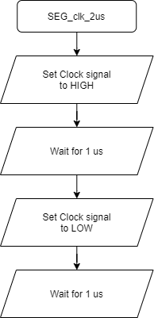

# Lab 5: YOUR_FIRSTNAME FAMILYNAME

Link to my `Digital-electronics-2` GitHub repository:

   [https://github.com/DavidSedlacekTN/Digital-electronics-2/tree/main/Labs/05-segment](https://github.com/DavidSedlacekTN/Digital-electronics-2/tree/main/Labs/05-segment)

## Preperation tasks

### 1. Common Cathode SSD VS Common Anode SSD
   * Common Cathode 7-segment display (CC SSD) - Individual segments are illuminated when idividual anodes are pulled HIGH. Each display has one Cathode.
   * Common Anode 7-segment display (CA SSD) - Individual segments are illuminated when idividual cathodes are pulled LOW. Each display has one Anode.

### 2. Binary values of the segments for display 0 to 9 on a CA SSD.

   | **Digit** | **A** | **B** | **C** | **D** | **E** | **F** | **G** | **DP** |
   | :-: | :-: | :-: | :-: | :-: | :-: | :-: | :-: | :-: |
   | 0 | 0 | 0 | 0 | 0 | 0 | 0 | 1 | 1 |
   | 1 | 1 | 0 | 0 | 1 | 1 | 1 | 1 | 1 |
   | 2 | 0 | 0 | 1 | 0 | 0 | 1 | 0 | 1 |
   | 3 | 0 | 0 | 0 | 0 | 1 | 1 | 0 | 1 |
   | 4 | 1 | 0 | 0 | 1 | 1 | 0 | 0 | 1 |
   | 5 | 0 | 1 | 0 | 0 | 1 | 0 | 0 | 1 |
   | 6 | 0 | 1 | 0 | 0 | 0 | 0 | 0 | 1 |
   | 7 | 0 | 0 | 0 | 1 | 1 | 1 | 1 | 1 |
   | 8 | 0 | 0 | 0 | 0 | 0 | 0 | 0 | 1 |
   | 9 | 0 | 0 | 0 | 0 | 1 | 0 | 0 | 1 |

### 3. Individual Arduino shield connections. 

   | **Anodes(Reg. U2)** | **Connects to** | **Notes** |
   | :-: | :-: | :-: | 
   | A1 | QA |  |
   | A2 | QB |  | 
   | A3 | QC |  | 
   | A4 | QD |  | 

   | **Cathodes(Reg. U3)** | **Connects to** | **Notes** |
   | :-: | :-: | :-: | 
   | a | QA |  |
   | b | QB |  |
   | c | QC |  |
   | d | QD |  |
   | e | QE |  |
   | f | QF |  |
   | g | QG |  |
   | h | QH | Decimal Point |

## CA SSD library

### 1. Code listing of interrupt service routines `TIMER1_OVF_vect`, `TIMER0_OVF_vect` from counter application.

```c
/**********************************************************************
 * Function: Timer/Counter1 overflow interrupt
 * Purpose:  Increment counter value from 00 to 59.
 **********************************************************************/
ISR(TIMER1_OVF_vect)
{
	if (ones < 9) {
		ones = ones + 1;
	}
	else {
		if (tens == 5) {
			tens = 0;	
		}
		else {
			tens = tens + 1;
		}
		ones = 0;
	}
	
}
```

```c
/**********************************************************************
 * Function: Timer/Counter0 overflow interrupt
 * Purpose:  Display tens and units of a counter at SSD.
 **********************************************************************/
ISR(TIMER0_OVF_vect)
{
	static uint8_t pos = 0;
	if (pos == 0) {
		SEG_update_shift_regs(ones, pos);
		pos = 1;
	}
	else {
		SEG_update_shift_regs(tens, pos);
		pos = 0;
	}
}
```

### 2. Flowchart figure for function `SEG_clk_2us()`.

   


### 3. Scheme of a kitchen alarm.

   