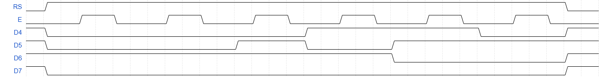
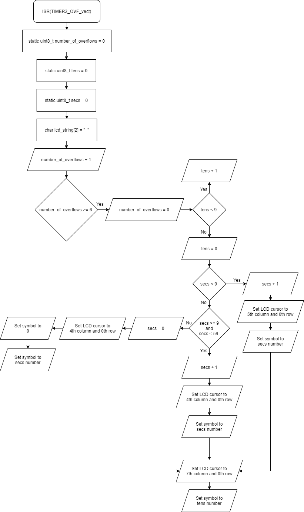
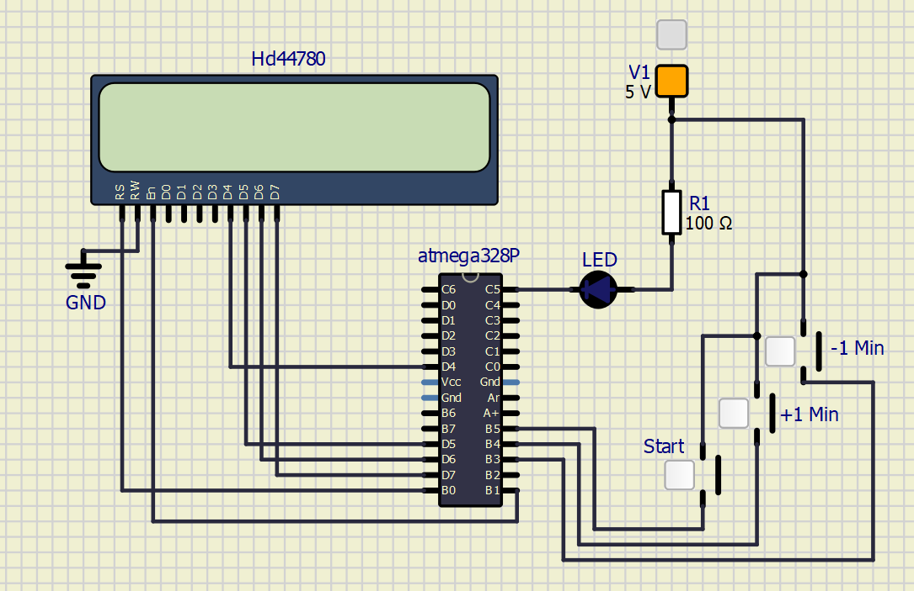

# Lab 6: Display devices, LCD display

Link to this file in your GitHub repository:

[https://github.com/DavidSedlacekTN/Digital-electronics-2/tree/main/Labs/06-led](https://github.com/DavidSedlacekTN/Digital-electronics-2/tree/main/Labs/06-led)

## 1. Preparation tasks

### Display connections
   | **LCD signal(s)** | **AVR pin(s)** | **Description** |
   | :-: | :-: | :-- |
   | RS | PB0 | Register selection signal. Selection between Instruction register (RS=0) and Data register (RS=1) |
   | R/W | GND | Choose whether to Read Data or Write Data to the Display Register |
   | E | PB1 | Enable Signal |
   | D[3:0] | - | Upper Nibble(Half of a byte) |
   | D[7:4] | PD7, PD6, PD5, PD4 | Lower Nibble, can transfer 2 Nibbles instead of a full byte(Slower, less pins needed) |

### ASCII Table
<table>
<tr><th>Upper Case</th><th>Lower Case</th><th>Numbers</th></tr>

<tr><td>

   | **Char** | **Decimal** | **Hexadecimal** |
   | :-: | :-: | :-: |
   | `A` | 65 | 0x41 |
   | `B` | 66 | 0x42 |
   | `C` | 67 | 0x43 |
   | `D` | 68 | 0x44 |
   | `E` | 69 | 0x45 |
   | `F` | 70 | 0x46 |
   | `G` | 71 | 0x47 |
   | `H` | 72 | 0x48 |
   | `I` | 73 | 0x49 |
   | `J` | 74 | 0x4a |
   | `K` | 75 | 0x4b |
   | `L` | 76 | 0x4c |
   | `M` | 77 | 0x4d |
   | `N` | 78 | 0x4e |
   | `O` | 79 | 0x4f |
   | `P` | 80 | 0x50 |
   | `Q` | 81 | 0x51 |
   | `R` | 82 | 0x52 |
   | `S` | 83 | 0x53 |
   | `T` | 84 | 0x54 |
   | `U` | 85 | 0x55 |
   | `V` | 86 | 0x56 |
   | `W` | 87 | 0x57 |
   | `X` | 88 | 0x58 |
   | `Y` | 89 | 0x59 |
   | `Z` | 90 | 0x5a |

</td><td>

   | **Char** | **Decimal** | **Hexadecimal** |
   | :-: | :-: | :-: |
   | `a` | 97 | 0x61 |
   | `b` | 98 | 0x62 |
   | `c` | 99 | 0x63 |
   | `d` | 100 | 0x64 |
   | `e` | 101 | 0x65 |
   | `f` | 102 | 0x66 |
   | `g` | 103 | 0x67 |
   | `h` | 104 | 0x68 |
   | `i` | 105 | 0x69 |
   | `j` | 106 | 0x6a |
   | `k` | 107 | 0x6b |
   | `l` | 108 | 0x6c |
   | `m` | 109 | 0x6d |
   | `n` | 110 | 0x6e |
   | `o` | 111 | 0x6f |
   | `p` | 112 | 0x70 |
   | `q` | 113 | 0x71 |
   | `r` | 114 | 0x72 |
   | `s` | 115 | 0x73 |
   | `t` | 116 | 0x74 |
   | `u` | 117 | 0x75 |
   | `v` | 118 | 0x76 |
   | `w` | 119 | 0x77 |
   | `x` | 120 | 0x78 |
   | `y` | 121 | 0x79 |
   | `z` | 122 | 0x7a |

</td><td>

   | **Char** | **Decimal** | **Hexadecimal** |
   | :-: | :-: | :-: |
   | `0` | 48 | 0x30 |
   | `1` | 49 | 0x31 |
   | `2` | 50 | 0x32 |
   | `3` | 51 | 0x33 |
   | `4` | 52 | 0x34 |
   | `5` | 53 | 0x35 |
   | `6` | 54 | 0x36 |
   | `7` | 55 | 0x37 |
   | `8` | 56 | 0x38 |
   | `9` | 57 | 0x39 |

</td></tr> </table>

## 2. Library for HD44780 based LCDs
   | **Function name** | **Function parameters** | **Description** | **Example** |
   | :-- | :-- | :-- | :-- |
   | `lcd_init` | `LCD_DISP_OFF`<br>`LCD_DISP_ON`<br>`LCD_DISP_ON_CURSOR`<br>`LCD_DISP_ON_CURSOR_BLINK` | Display off | `lcd_init(LCD_DISP_OFF);` |
   | `lcd_clrscr` | - | Clear display and set cursor to home position | `lcd_clrscr();` |
   | `lcd_gotoxy` | `x` coordinate<br>`y` coordinate | Set cursor to specified position | `lcd_gotoxy(2,2);` |
   | `lcd_putc` | `c` character | Display character at current cursor position | `lcd_putc('c');` |
   | `lcd_puts` | `s` string | Display string without auto linefeed | `lcd_puts('Hello World');` |
   | `lcd_command` | `cmd` command | Send LCD controller instruction command | `lcd_command(see HD44780 data sheet);` |
   | `lcd_data` | `data` | Send data byte to LCD controller | `lcd_data(see HD44780 data sheet)` |

## 3. LCD display module

1. Describe what ASCII table is
   * ASCII table: Simple table, where all symbols are listed with their binary, decimal, hexacedimal (etc.) representations.

2. Picture of time signals between ATmega328P and LCD keypad shield (HD44780 driver) when transmitting three character data `De2`.

   


## 4. Stopwatch

1. Flowchart figure for `TIMER2_OVF_vect` interrupt service routine

   


## 5. Custom characters

1. Code listing of two custom character definition. Always use syntax highlighting and meaningful comments:

```c
/* Variables ---------------------------------------------------------*/
// Custom character definition
uint8_t customChar[16] = {
	0b00000, // First line of the first symbol
	0b01110,
	0b10101,
	0b10111,
	0b10001,
	0b01110,
	0b01110,
	0b11111, // Last line of the first symbol
	0b00000, // First line of the second symbol
	0b11011,
	0b01010,
	0b00000,
	0b01110,
	0b11111,
	0b11011,
	0b00000  // Last line of the first symbol
};
```

## 6. Kitchen alarm

1. Scheme of kitchen alarm

   