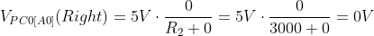

## 1. Preparation Tasks

1. Find out the connection of five push buttons: Select, Left, Up, Down, and Right.

   | **Button** | **Switch** | **Connects to** | **Connects via** |
   | :-: | :-: | :-: | :-: |
   | RIGHT | SW1 | PC0 | Voltage divider 3k/5,25k |
   | UP | SW2 | PC0 | Voltage divider 3,33k/4,92k |
   | DOWN | SW3 | PC0 | Voltage divider 3,92k/4,3k |
   | LEFT | SW4 | PC0 | Voltage divider 3,92k/4,3k |
   | SELECT | SW5 | PC0 | Voltage divider 4,92k/3,3k |
   | RST | SW6 | RESET | No Resistor |

2. According to the connection, calculate the voltage values on pin PC0[A0] if one button is pressed at a time. In this case, the voltage on the pin is given by the [voltage divider](https://www.allaboutcircuits.com/tools/voltage-divider-calculator/), where resistors R3, R4, R5 and R6 are applied successively.

   

   

   

3. Calculate the voltage value if none of the push buttons is pressed.

   

4. Calculate the ADC values for these voltages according to the following equation if reference is Vref=5V and number of bits for analog to digital conversion is n=10.

   

   | **Push button** | **PC0[A0] voltage** | **ADC value (calculated)** | **ADC value (measured)** |
   | :-: | :-: | :-: | :-: |
   | Right  | 0V | 0 | 0 |
   | Up     | 0.495V | 101 | 99 |
   | Down   | 1.203V | 246 | 256 |
   | Left   | 1.970V | 403 | 410 |
   | Select | 3.182V | 651 | 640 |
   | None   | 5.0V | 1023 | 1023 |

## 2. Analog-to-Digital Conversion

   | **Operation** | **Register(s)** | **Bit(s)** | **Description** |
   | :-- | :-: | :-: | :-- |
   | Voltage reference    | ADMUX | REFS[1:0] | 00: AREF(Vref off), 01: AVcc voltage reference (5V), 10: Reserved, 11: Internal 1.1V voltage reference |
   | Input channel        | ADMUX | MUX[3:0] | 0000: ADC0, 0001: ADC1, 0010: ADC2, 0011:ADC3, 0100:ADC4, 0101:ADC5, 0110:ADC6, 0111:ADC7, 1000:ACD8, 1001-1101: Reserved, 1110: 1.1V(Vbg), 1111:0V(GND) |
   | ADC enable           | ADCSRA | ADEN | 0: ADC Disable, 1: ADC Enable |
   | Start conversion     | ADCSRA | ADSC | 0: Standard, 1: In Freerunning mode starts the first conversion |
   | ADC interrupt enable | ADCSRA | ADIE | 0: Intrerrupt disabled, 1: (If I-bit in SREG is one) Interrupt enabled |
   | ADC clock prescaler  | ADCSRA | ADPS[2:0] | 000: Division Factor 2, 001: 2, 010: 4, 011: 8, 100: 16, 101: 32, 110: 64, 111: 128 |
   | ADC 10-bit result    | ADCL+ADLAR | ADC[9:0] | These bits represent the result from the conversion |

## 3. UART Communication

   | **Function name** | **Function parameter(s)** | **Description** | **Example** |
   | :-- | :-- | :-- | :-- |
   | `uart_init` | `UART_BAUD_SELECT(9600, F_CPU)` | Initialize UART to 8N1 and set baudrate to 9600&nbsp;Bd | `uart_init(UART_BAUD_SELECT(9600, F_CPU));` |
   | `uart_getc` | `` | Return byte from ringbuffer | `uart_getc()` |
   | `uart_putc` | `Character` | Write byte to ringbuffer for transmitting via UART | uart_putc('e') |
   | `uart_puts` | `String` | Transmit string to UART | `uart_puts("Example")` |
