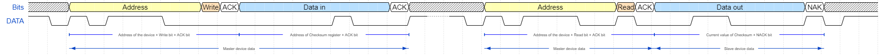
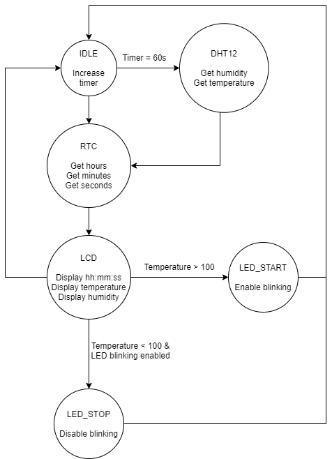

## 1. Preparation tasks

### 1. Use schematic of the [Arduino Uno](../../Docs/arduino_shield.pdf) board and find out to which pins the SDA and SCL signals are connected.

   | **Signal** | **MCU pin** | **Arduino pin(s)** |
   | :-: | :-: | :-: |
   | SDA (data)  | PC4 | A4 |
   | SCL (clock) | PC5 | A5 |

### 2. What is the general structure of I2C address and data frames?

   | **Frame type** | **8** | **7** | **6** | **5** | **4** | **3** | **2** | **1** | **0** | **Description**&nbsp;&nbsp;&nbsp;&nbsp;&nbsp;&nbsp;&nbsp;&nbsp;&nbsp;&nbsp;&nbsp;&nbsp;&nbsp;&nbsp;&nbsp;&nbsp;&nbsp;&nbsp;&nbsp;&nbsp;&nbsp;&nbsp;&nbsp;&nbsp;&nbsp;&nbsp;&nbsp;&nbsp;&nbsp;&nbsp;&nbsp;&nbsp;&nbsp;&nbsp;&nbsp;&nbsp;&nbsp;&nbsp;&nbsp;&nbsp;&nbsp;&nbsp;&nbsp;&nbsp; |
   | :-: | :-: | :-: | :-: | :-: | :-: | :-: | :-: | :-: | :-: | :-- |
   | Address | A6 | A5 | A4 | A3 | A2 | A1 | A0 | R/W | ACK | R - Request Data[1], W - Send Data[0] |
   | Data    | D7 | D6 | D5 | D4 | D3 | D2 | D1 | D0 | ACK | |

## 2. I2C Scanner

### 1. Function table for the `twi.c` libary.

   | **Function name** | **Function parameters** | **Description** | **Example** |
   | :-- | :-- | :-- | :-- |
   | `twi_init` | None | Initialize TWI, enable internal pull-up resistors, and set SCL frequency. | `twi_init();` |
   | `twi_start` | SLA+R or SLA+W address | Start communication on TWI bus and send address of TWI slave. | `twi_start((addr<<1)+TWI_READ);` |
   | `twi_write` | Byte of data | Send one data byte to TWI slave device. | `twi_write(data);` |
   | `twi_read_ack` | None | Read one byte from TWI slave device and acknowledge it by ACK. | `twi_read_ack();` |
   | `twi_read_nack` | None | Read one byte from TWI slave device and acknowledge it by NACK. | `twi_read_nack();` |
   | `twi_stop` | None | Generates stop condition on TWI bus. | `twi_stop();` |

### 2. Code listing of Timer1 overflow interrupt service routine for scanning I2C devices and rendering a clear table on the UART.

```c
/**********************************************************************
 * Function: Timer/Counter1 overflow interrupt
 * Purpose:  Update Finite State Machine and test I2C slave addresses 
 *           between 8 and 119.
 **********************************************************************/
ISR(TIMER1_OVF_vect)
{
    static state_t state = STATE_IDLE;  // Current state of the FSM
    static uint8_t addr = 7;    // I2C slave address
    uint8_t value;              // Data obtained from the I2C bus
    char uart_string[] = "00";  // String for converting numbers by itoa()

    // FSM
    switch (state)
    {
    // Increment I2C slave address
    case STATE_IDLE:
        addr++;
        // If slave address is between 8 and 119 then move to SEND state
		if ((addr > 7) && (addr < 120)) { // Not specified whether it is including or excluding border numbers. I chose <8; 119> interval.
			state = STATE_SEND;
		}
		else {
			addr = 7; // Loop is not necessary, although is quite helpful in case of connecting other devices during the cycle. 
		}
		break;
    
    // Transmit I2C slave address and get result
    case STATE_SEND:
        // I2C address frame:
        // +------------------------+------------+
        // |      from Master       | from Slave |
        // +------------------------+------------+
        // | 7  6  5  4  3  2  1  0 |     ACK    |
        // |a6 a5 a4 a3 a2 a1 a0 R/W|   result   |
        // +------------------------+------------+
        value = twi_start((addr<<1) + TWI_WRITE);
        twi_stop();
        /* Test value obtained from I2C bus. If it is 0 then move to ACK
         * state, otherwise move to IDLE */
		if (value == 0) {
			state = STATE_ACK;
		}
		else {
			state = STATE_IDLE;
		}
        break;

    // A module connected to the bus was found
    case STATE_ACK:
        // Send info about active I2C slave to UART and move to IDLE
		itoa(addr, uart_string, 16);
		uart_puts("Active address found: ");
		uart_puts(uart_string);
		uart_puts("/n/r");
		state = STATE_IDLE;
        break;

    // If something unexpected happens then move to IDLE
    default:
        state = STATE_IDLE;
        break;
    }
}
```

### 3. Picture of I2C signals when reading checksum from DHT12 sensor.

   

## 3. Meteo station

### 1. Finite State Machine diagram of the meteorogical station.
   
   